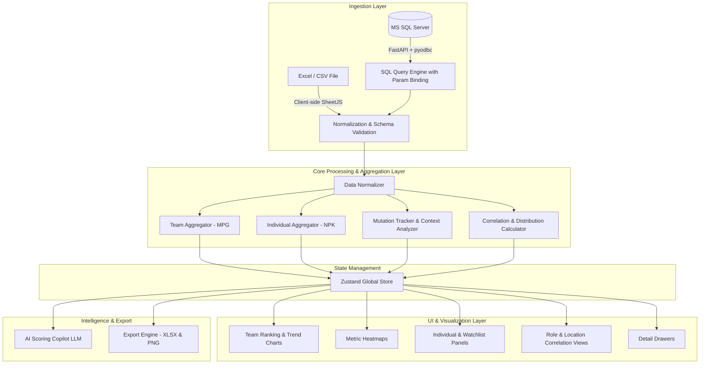

# 📊 iScore Analytics — Operational Performance Scoring & Diagnostic Platform

<div align="center">

[](https://react.dev/)
[](https://www.typescriptlang.org/)
[](https://vitejs.dev/)
[](https://tailwindcss.com/)
[](https://fastapi.tiangolo.com/)
[](https://vitest.dev/)
[](#)

<p align="center">
  <b>Platform analitik dan diagnostik performa operasional berbasis web modern untuk profiling multi-level: Tim (MPG), Individu (NPK), Komparasi Jabatan (CSM / CE / SPS), Korelasi Regional, serta Asisten AI Cerdas.</b>
</p>

[Fitur Utama](#-fitur-utama) • [Arsitektur](#-arsitektur-sistem) • [Skema & Metrik](#-skema-data--kamus-metrik) • [Instalasi & Menjalankan](#-panduan-instalasi--menjalankan) • [AI Scoring Copilot](#-ai-scoring-copilot) • [Struktur Proyek](#-struktur-direktori)

</div>

---

## 🌟 Sekilas Tentang iScore Analytics

**iScore Analytics** mentransformasi evaluasi performa operasional berskala besar (ribuan baris data bulanan) dari spreadsheet statis menjadi wawasan prediktif dan diagnostik interaktif. 

Dirancang khusus untuk mendukung Service Operations & Field Management, sistem ini mengurai metrik kompleks peranan **CSM** (*Customer Service Manager*), **CE** (*Customer Engineer*), dan **SPS** (*Spare Part Specialist*) ke dalam visualisasi analitik terpadu.

```
┌────────────────────────────────────────────────────────────────────────────────────────┐
│                                   iScore Analytics                                     │
├───────────────────────────────────┬────────────────────────────────────────────────────┤
│ 🏢 Profiling Tim (MPG)            │ 👤 Profiling Individu & Jabatan                    │
│ • Ranking Komposit & Volatilitas  │ • Trajektori Historis 9-Bulan per NPK              │
│ • Analisis Tren 9-Bulan           │ • Deteksi Mutasi Kerja & Dampak Penempatan         │
│ • Heatmap 5Scale CSM & CE         │ • Watchlist ("Perlu Perhatian") & Top Performers   │
│ • Scatter Ukuran Tim vs Skor      │ • Komparasi Jabatan (Box Plot & CE vs SPS)         │
│ • Pros & Cons Naratif Otomatis    │ • Korelasi Supervisor (CSM) vs Anak Buah           │
├───────────────────────────────────┴────────────────────────────────────────────────────┤
│ 🤖 AI Scoring Copilot • 📥 Dual Ingestion (Client-Side Excel & Direct MS SQL Server)   │
└────────────────────────────────────────────────────────────────────────────────────────┘
```

---

## 🚀 Fitur Utama

### 1. 🏢 Profiling Tim (MPG - Machine Production Group)
* **Tabel Ranking Cerdas**: Menampilkan urutan performa seluruh tim berdasarkan rata-rata skor `TOTAL`, tren arah (naik/turun/stabil beserta $\Delta\%$), indeks volatilitas (standar deviasi), jumlah anggota, serta rasio komposisi `HO` vs `SERPO`.
* **Grafik Tren Longitudinal**: Visualisasi perkembangan performa bulanan dengan pembanding garis rata-rata perusahaan (*Benchmark Reference Line*). Mendukung komparasi langsung hingga 5+ tim secara simultan dengan mode terpisah antara CSM dan Teknisi.
* **Metric Heatmap (5Scale)**: Pemetaan visual kekuatan dan kelemahan metrik dengan gradasi warna intuitif (*red-yellow-green*), memisahkan metrik spesifik Supervisor (CSM) dan Teknisi (CE).
* **Korelasi Ukuran vs Performa**: Analisis scatter plot untuk menguji korelasi antara jumlah personel dalam tim terhadap capaian skor akhir.
* **Sintesis Pros & Cons Otomatis**: Algoritma cerdas yang mengekstrak 3 kekuatan utama (*Pros*) dan 3 area perbaikan (*Cons*) berbasis deviasi terhadap *company mean*.
* **Team Detail Drawer**: Panel laci interaktif untuk melihat rincian setiap anggota tim, riwayat skor, dan breakdown metrik mendalam.

### 2. 👤 Profiling Individu (NPK) & Komparasi Jabatan
* **Pencarian Cepat Personil**: Pencarian instan berdasarkan Nama atau NPK karyawan.
* **Watchlist & Top Performer**:
  * ⚠️ **Watchlist (Perlu Perhatian)**: Mendeteksi personel dengan tren menurun yang berada di bawah rata-rata rekan sejabatan (*peer group*).
  * 🌟 **Top Performers**: Mengidentifikasi personel dengan konsistensi skor tinggi dan tren positif.
* **Deteksi Mutasi & Analisis Konteks Penempatan**:
  * Melacak otomatis riwayat perpindahan tim (`MPG`), promosi jabatan (`CSM/CE/SPS`), dan mutasi cabang (`Loc`/`Lokasi`).
  * Mengukur varians performa *sebelum vs sesudah mutasi* secara kuantitatif.
* **Komparasi Lintas Jabatan**:
  * Box plot sebaran distribusi nilai (Min, Q1, Median, Mean, Q3, Max) per kelompok jabatan.
  * Komparasi *head-to-head* metrik teknisi: **CE vs SPS**.
* **Korelasi Supervisor $\leftrightarrow$ Teknisi**:
  * Menghitung koefisien korelasi Pearson ($r$) antara skor CSM terhadap rata-rata anak buahnya dalam tim.
  * Dilengkapi penanda ukuran sampel ($n$) untuk memastikan validitas statistik.
* **Analisis Geografis & Cabang (`Loc`)**:
  * Evaluasi disparitas performa Head Office (`HO`) vs Service Point (`SERPO`).
  * Ranking performa cabang dengan proteksi penanda *small sample alert* ($n < 3$).

### 3. 🤖 AI Scoring Copilot (Chat & Diagnostic Agent)
* Terintegrasi dengan antarmuka chat cerdas yang memahami konteks data scoring yang sedang aktif di dashboard.
* Mampu menjawab pertanyaan manajerial:
  * *"Tim mana yang memiliki penurunan performa paling tajam bulan ini?"*
  * *"Siapa saja teknisi di watchlist yang perlu mendapatkan prioritas coaching?"*
  * *"Bagaimana korelasi antara skor CSM dengan hasil teknisi di lapangan?"*
* Kompatibel dengan OpenAI API dan model LLM kustom via reverse proxy / environment variables.

### 4. 📥 Fleksibilitas Sumber Data (Dual Ingestion Mode)
* **Mode 1 — Excel/CSV Client-Side (Zero Server Upload)**:
  * Memanfaatkan **SheetJS** untuk parsing 100% di browser.
  * Data sensitif perusahaan tidak pernah meninggalkan komputer pengguna.
  * Validasi skema ketat dengan pelaporan error dan peringatan yang jelas.
* **Mode 2 — Direct MS SQL Server Connection**:
  * Koneksi langsung ke database SQL Server melalui backend FastAPI berkecepatan tinggi.
  * Query editor interaktif dengan parameter binding otomatis (`@MPG`, `@PeriodeStart`, `@PeriodeEnd`).
  * Proteksi keamanan read-only (menolak DML, DDL, multi-statement, dan `SELECT INTO`).

### 5. 📤 Export & Pelaporan
* **Export ke Excel (`.xlsx`)**: Unduh data ranking yang sedang difilter ke spreadsheet rapi dalam satu klik.
* **Export Grafik ke PNG**: Unduh grafik tren dan heatmap dengan resolusi tinggi via `html-to-image`.

---

## 🏗️ Arsitektur Sistem



---

## 📐 Skema Data & Kamus Metrik

Aplikasi memproses file evaluasi scoring dalam format panjang (*long format*), di mana 1 baris mewakili 1 kombinasi `(NPK, Periode)`.

### 1. Kolom Identitas Inti
| Kolom | Tipe | Deskripsi |
|---|---|---|
| `Periode` | Date / Serial Number | Tanggal snapshot evaluasi bulanan |
| `MPG` | String | Kode tim operasional (Unit analisis utama) |
| `WCTR` | String | Sub-unit kerja / workstation code |
| `Nama` | String | Nama lengkap personel |
| `NPK` | Number / String | ID unik karyawan |
| `Jabatan` | Enum (`CSM`, `CE`, `SPS`) | Peran kerja personel |
| `Lokasi` | Enum (`HO`, `SERPO`) | Kategori penempatan kerja |
| `Loc` | String | Kode cabang lokasi (misal: `MDN`, `JKT-PST`) |
| `TOTAL` | Float | Skor evaluasi akhir (1.00 – 5.00) |

### 2. Hierarki Kalkulasi Metrik
Pola penamaan metrik mengikuti struktur: `{Tahap}_{NamaMetrik}_{Jabatan}`
$$\text{Achievement (Realisasi)} \longrightarrow \text{Target} \longrightarrow \text{Weighted (Bobot)} \longrightarrow \text{5Scale (Skor 1-5)} \longrightarrow \text{SubTotal}$$
$$\text{TOTAL} = \sum \text{SubTotal}$$

### 3. Kamus Metrik per Jabatan
* **Metrik CSM (Customer Service Manager - 7 Metrik)**:
  `MoP`, `CostPerRevenue`, `CSAT`, `LWH`, `RTSuccessRatio`, `LoL`, `ReturnCons`.
* **Metrik CE & SPS (Customer Engineer & Spare Part Specialist - 8 Metrik)**:
  `MoP`, `CostPerRevenue`, `RTFirstVisit`, `WkTS`, `TSM`, `ProductivityCall`, `SupportIT`, `CEComSkill`.

---

## 💻 Tech Stack

| Kategori | Teknologi | Kegunaan |
|---|---|---|
| **Frontend Framework** | React 19 + TypeScript | UI berbasis komponen reaktif dengan type safety penuh |
| **Bundler & Tooling** | Vite 6 | Development server super cepat dan build bundle optimal |
| **State Management** | Zustand 5 | Manajemen state global terpusat dan reaktif |
| **Styling** | Tailwind CSS 3.4 + Custom Glassmorphism | Desain antarmuka modern bernuansa dark mode premium |
| **Visualisasi Data** | Recharts 3.x | Grafik tren interaktif, scatter plot, dan distribusi |
| **Data Processing** | SheetJS (`xlsx`) | Parsing dan manipulasi file Excel secara client-side |
| **Backend API** | FastAPI (Python 3.11+) + Uvicorn | Gateway konektivitas database SQL Server read-only |
| **Database Driver** | `pyodbc` + ODBC Driver 18 | Akses berkinerja tinggi ke MS SQL Server |
| **Testing** | Vitest + React Testing Library + Pytest | Unit test dan integration test komprehensif |

---

## 🛠️ Panduan Instalasi & Menjalankan

### Prasyarat Sistem
* **Node.js**: `v18.0.0` atau versi lebih baru
* **npm**: `v9.0.0` atau versi lebih baru
* *(Opsional untuk koneksi SQL Server)*: **Python 3.11+** dan **Microsoft ODBC Driver 18 for SQL Server**

---

### Langkah 1: Clone Repository
```bash
git clone https://github.com/kodok-ijho/AnalyticScoring.git
cd AnalyticScoring
```

### Langkah 2: Menjalankan Frontend (Mode Standar - Excel Upload)
1. Install seluruh dependensi frontend:
   ```bash
   npm install
   ```
2. Buat file `.env` dari template:
   ```bash
   cp .env.example .env
   ```
3. Jalankan development server:
   ```bash
   npm run dev
   ```
4. Buka peramban di `http://localhost:5173`. Unggah file scoring Anda (tersedia contoh di folder `doc/Scoring JUN26.xlsx`).

---

### Langkah 3: Menjalankan Backend (Opsional - MS SQL Server Mode)
Jika Anda ingin menggunakan koneksi langsung ke SQL Server:

1. Masuk ke direktori `backend`:
   ```bash
   cd backend
   ```
2. Install dependensi Python:
   ```bash
   python -m pip install -e ".[dev]"
   ```
3. Jalankan server FastAPI:
   ```bash
   python -m uvicorn app.main:app --host 127.0.0.1 --port 8000 --reload
   ```
4. Jalankan frontend di terminal terpisah (`npm run dev`). Request `/api` akan secara otomatis di-*proxy* ke port 8000 oleh Vite.

---

## 🧪 Menjalankan Pengujian (Testing)

### Frontend Unit & Integration Tests (Vitest)
```bash
# Menjalankan seluruh test suite
npm test

# Menjalankan test dalam mode watch
npm run test:watch
```

### Backend Tests (Pytest)
```bash
cd backend
pytest
```

---

## 🤖 Konfigurasi AI Scoring Copilot

Untuk mengaktifkan fitur AI Chat di dashboard, lengkapi variabel berikut pada file `.env`:

```env
# URL endpoint OpenAI / LLM API compatible
VITE_AI_CHAT_ENDPOINT=https://api.openai.com/v1/chat/completions

# API Key Anda
VITE_AI_CHAT_API_KEY=your_api_key_here

# Model yang digunakan (contoh: gpt-4o, gpt-4o-mini, dll)
VITE_AI_CHAT_MODEL=gpt-4o-mini
```

---

## 📁 Struktur Direktori

```plaintext
AnalyticScoring/
├── backend/                  # Python FastAPI Backend (SQL Server Connector)
│   ├── app/
│   │   ├── api/              # Endpoint routing (SQL Server query & health)
│   │   ├── core/             # Konfigurasi & security sanitizers
│   │   ├── db/               # pyodbc database pool & connection logic
│   │   └── main.py           # FastAPI application entrypoint
│   ├── tests/                # Pytest unit & integration tests
│   └── pyproject.toml        # Dependensi & metadata Python
├── doc/                      # Dokumentasi & file contoh scoring
│   ├── SCORING GUIDANCE 2026.pdf
│   └── Scoring JUN26.xlsx
├── docs/                     # Panduan teknis & integrasi
│   └── sqlserver-input.md
├── public/                   # Asset statis
├── src/                      # Source code Frontend React
│   ├── components/           # Komponen UI modular
│   │   ├── chat/             # AI Scoring Chat Panel & Copilot
│   │   ├── common/           # Komponen reusable (ErrorBoundary, Loading, dll)
│   │   ├── composition/      # Scatter plot ukuran tim vs performa
│   │   ├── correlation/      # Scatter CSM-Teknisi & ranking cabang
│   │   ├── detail/           # Drawer detail tim & drilldown anggota
│   │   ├── heatmap/          # Metric Heatmap 5Scale
│   │   ├── individual/       # Search NPK, Watchlist, Top Performer, Mutasi
│   │   ├── jabatan/          # Distribusi Box Plot & CE vs SPS Panel
│   │   ├── layout/           # DashboardShell, Header, & FilterBar
│   │   ├── ranking/          # Tabel ranking komposit tim
│   │   ├── trend/            # Grafik tren multi-tim longitudinal
│   │   └── upload/           # Drag-and-drop uploader & SQL Server Panel
│   ├── lib/                  # Logika bisnis, agregasi, & algoritma statistik
│   │   ├── aggregateIndividuals.ts # Kalkulasi trajektori & metrik NPK
│   │   ├── aggregateTeams.ts       # Kalkulasi agregasi tim & tren
│   │   ├── aiAnalysis.ts           # Heuristik pros/cons & ringkasan otomatis
│   │   ├── contextAnalysis.ts      # Analisis dampak mutasi & penempatan
│   │   ├── correlation.ts          # Perhitungan koefisien Pearson r & p-stats
│   │   ├── normalizeRows.ts        # Normalisasi & penyesuaian tipe data
│   │   ├── parseWorkbook.ts        # Parser SheetJS client-side
│   │   ├── scoringChat.ts          # Integrasi prompt & LLM chat API
│   │   └── validateSchema.ts       # Validasi skema & kontrak kolom Excel
│   ├── store/                # Zustand global store (`useDashboardStore.ts`)
│   ├── tests/                # Vitest unit & integration test suites
│   ├── App.tsx               # Root application component
│   ├── index.css             # Tailwind CSS & custom design tokens
│   ├── main.tsx              # React DOM mounting
│   └── types.ts              # TypeScript interfaces & domain types
├── package.json              # Konfigurasi dependensi Node.js
├── tailwind.config.js        # Konfigurasi tema Tailwind CSS
├── tsconfig.json             # Konfigurasi TypeScript
└── vite.config.ts            # Konfigurasi Vite & proxy settings
```

---

## 🔒 Keamanan & Privasi Data

1. **Privasi Penuh (Excel Mode)**: File yang diunggah diproses seluruhnya di dalam memori peramban (*client-side execution*). Tidak ada data NPK, skor, atau identitas karyawan yang dikirim ke server luar.
2. **Koneksi Database Aman (SQL Server Mode)**:
   - Akses bersifat **read-only** (hanya kueri `SELECT` dan `WITH` yang diizinkan).
   - Dilengkapi validasi sintaksis untuk mencegah eksekusi DML (`INSERT`, `UPDATE`, `DELETE`), DDL (`DROP`, `ALTER`), `EXEC`, maupun multi-statement injection.
   - Kredensial kata sandi tidak pernah disimpan secara permanen di browser (*stateless request*).

---

## 📄 Lisensi & Hak Cipta

© 2026 **iScore Analytics Team**. Seluruh hak cipta dilindungi undang-undang.
Dibuat untuk kebutuhan analisis dan optimalisasi performa operasional.
